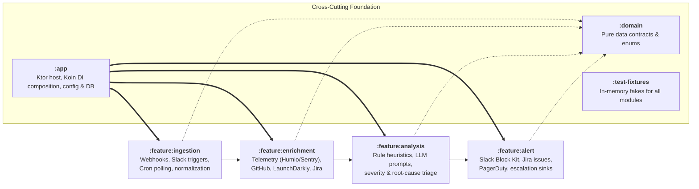

# Argus — Feature-Based Microservice Architecture & Plan

## Architectural Overview

Argus is an automated alert aggregator and triage service. It ingests alerts across multiple sources, enriches them with
telemetry and infrastructure context concurrently, analyzes them using heuristics and a local LLM (Ollama), and delivers
actionable, formatted incident briefs to Slack and other operational sinks.

The codebase is organized into **feature-first modules** representing each distinct phase of the alert triage lifecycle,
plus shared domain models and server plumbing.



---

## Module Breakdown & Responsibilities

```
argus/
├── settings.gradle.kts              # includes domain, feature:ingestion, feature:enrichment, feature:analysis, feature:alert, app, test-fixtures
├── build.gradle.kts                 # root build file
├── gradle/libs.versions.toml        # SSOT for library coordinates and versions
├── build-logic/convention/          # argus.kotlin.library & argus.ktor.app plugins
├── docs/                            # Documentation & Feature Specifications
│   ├── openapi.yaml                 # OpenAPI 3.0.3 specification
│   ├── PLAN.md                      # Architecture & Roadmap
│   └── spec/                        # Feature Specifications & AGENTS.md implementation guide
│       ├── AGENTS.md                # Feature specification & implementation guide
│       ├── 01-ingestion.md
│       ├── 02-enrichment.md
│       ├── 03-analysis.md
│       └── 04-alert.md
│
├── domain/                          # Pure domain models & contracts (zero framework deps)
│   └── src/main/kotlin/com/argus/domain/
│       ├── model/                   # RawAlert, EnrichedContext, AlertDecision, TeamConfig, MetricSample
│       └── pipeline/                # TriagePipeline and stage interfaces
│
├── feature/                         # Feature parent directory
│   ├── ingestion/                   # Inbound alert triggers & normalization
│   │   └── src/main/kotlin/com/argus/ingestion/
│   │       ├── routes/              # Ktor routes: POST /triggers/webhook, POST /triggers/slack
│   │       ├── normalizer/          # Adapters translating provider payloads into RawAlert
│   │       ├── service/             # IngestionService handling triage intake
│   │       └── di/                  # IngestionModule.kt (Koin)
│   │
│   ├── enrichment/                  # Context aggregation & telemetry integrations
│   │   └── src/main/kotlin/com/argus/enrichment/
│   │       ├── telemetry/           # TelemetryRegistry, HumioProvider, SentryProvider, FirebaseProvider
│   │       ├── provider/            # ContextProvider, GitHub/LD/Jira/TelemetryContextProvider
│   │       ├── service/             # AlertEnricher (concurrent coroutine fan-out)
│   │       └── di/                  # EnrichmentModule.kt (Koin)
│   │
│   ├── analysis/                    # Triage intelligence (heuristics + LLM)
│   │   └── src/main/kotlin/com/argus/analysis/
│   │       ├── llm/                 # LlmClient, OllamaClient, TriagePromptBuilder
│   │       ├── rules/               # SeverityEvaluator, IncidentWindowMatcher, RootCauseHeuristics
│   │       ├── service/             # TriageEngine
│   │       └── di/                  # AnalysisModule.kt (Koin)
│   │
│   └── alert/                       # Outbound delivery & notification sinks
│       └── src/main/kotlin/com/argus/alert/
│           ├── slack/               # SlackAlertSink, SlackBlockKitFormatter
│           ├── sink/                # AlertSink interface & routing
│           └── di/                  # AlertModule.kt (Koin)
│
├── app/                             # Application runtime & server composition
│   └── src/main/kotlin/com/argus/app/
│       ├── Application.kt           # main(), module(), Ktor plugins, routing bootstrap
│       ├── config/                  # AppConfig (HOCON), TeamYamlLoader, TeamRepository, TeamConfigSync
│       ├── routes/                  # HealthRoute (GET /health)
│       └── di/                      # AppModule.kt (aggregates Ingestion, Enrichment, Analysis, Alert modules)
│
└── test-fixtures/                   # Shared test fakes & testing utilities
    └── src/main/kotlin/com/argus/test/fakes/
        ├── FakeTelemetryRegistry.kt
        ├── FakeContextProvider.kt
        ├── FakeAlertSink.kt
        └── FakeLlmClient.kt
```

---

## Dependency & Boundary Rules

1. **`:domain` is completely isolated**: Depends only on `kotlinx.serialization` and `kotlinx-datetime`. It never
   depends on Ktor, Exposed, Koin, or any other module.
2. **Feature modules depend only on `:domain`**: `:feature:ingestion`, `:feature:enrichment`, `:feature:analysis`, and
   `:feature:alert` depend on `:domain` and their specific library dependencies (e.g. Ktor client, Ktor routing), never
   on each other.
3. **`:app` is the composition root**: `:app` depends on all feature modules and `:domain` to wire Koin dependency
   injection, load configuration, run database synchronizations, and attach HTTP routes.
4. **`:test-fixtures` provides fakes**: Implements interfaces defined in `:domain` / feature modules for zero-mock
   testing across all modules.

---

## Key Extensibility Seams

| Feature Area               | Extension Seam                            | How to Add New Functionality                                                                                |
|----------------------------|-------------------------------------------|-------------------------------------------------------------------------------------------------------------|
| **New Ingestion Source**   | Ingestion normalizers / routes            | Add a parser in `:feature:ingestion` mapping the external webhook payload into `RawAlert`.                  |
| **New Telemetry Source**   | `TelemetryProvider` + `TelemetryRegistry` | Implement `TelemetryProvider` in `:feature:enrichment` and register its factory key in `TelemetryRegistry`. |
| **New Integration Source** | Context Client interface                  | Add client interface and adapter in `:feature:enrichment` and incorporate into `AlertEnricher`.             |
| **New LLM / Triage Rule**  | `LlmClient` / `TriageEngine`              | Add client or heuristic stage in `:feature:analysis`.                                                       |
| **New Delivery Sink**      | `AlertSink`                               | Implement `AlertSink` in `:feature:alert` (e.g. MS Teams, PagerDuty, Webhook).                              |

---

## Concurrency, Scalability & Resilience

- **Concurrent Enrichment**: Uses `supervisorScope` with `async { ... }` across telemetry, GitHub, Jira, and
  LaunchDarkly. Isolated error handling ensures that a failure in one external system (e.g. Sentry timeout) does not
  abort the triage pipeline; partial context is forwarded to analysis.
- **Asynchronous Ingestion**: Ingestion routes immediately return `202 Accepted` and offload processing via Kotlin
  Coroutine channels to background workers.
- **Fast Startup & Schema Validation**: SQLite schema is initialized at startup and validated against team YAML
  configurations; referencing an unregistered telemetry provider fails fast at boot.

---

## Implementation Roadmap

- [x] **Phase 1**: Initial scaffolding and build-logic convention setup.
- [x] **Phase 2**: Multi-module architecture baseline.
- [x] **Phase 3**: Refactor to feature-based module layout (`:domain`, `:feature:ingestion`, `:feature:enrichment`,
  `:feature:analysis`, `:feature:alert`, `:app`, `:test-fixtures`) with interface-driven abstractions and Koin DI
  swappability.
- [x] **Phase 4**: Ingestion normalizers & background triage worker channel.
- [x] **Phase 5**: Parallel context gatherer (`AlertEnricher`) with concrete telemetry/integration clients.
- [ ] **Phase 6**: LLM prompt synthesis & heuristic severity evaluation in `:analysis`.
- [ ] **Phase 7**: Slack Block Kit layout rendering and multi-sink dispatcher in `:alert`.
- [ ] **Phase 8 (Tooling & Quality)**: Automated OpenAPI documentation enforcement in CI (verifying route coverage against `docs/openapi.yaml`).

