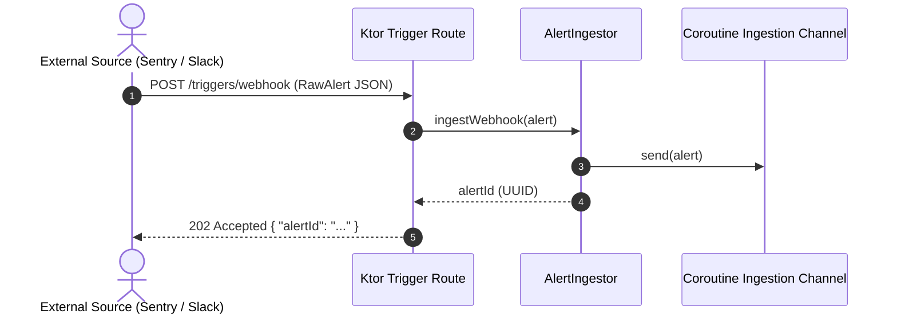

# Specification: Ingestion Feature (`:feature:ingestion`)

## 1. Overview & Objective
The Ingestion feature provides the entrypoint for all inbound alert triggers. It receives alert events via external HTTP webhooks (Sentry, Humio, Datadog, Prometheus) and interactive Slack triggers (slash commands), normalizes them into a canonical `RawAlert` data contract, and queues them for asynchronous triage processing.

---

## 2. Domain Models & Contracts

### `com.argus.domain.model.RawAlert`
```kotlin
@Serializable
data class RawAlert(
    val id: String = UUID.randomUUID().toString(),
    val teamId: String,
    val source: String,
    val title: String,
    val payload: String = "",
)
```

### Inbound Ingestion Request DTOs
```kotlin
@Serializable
internal data class SlackTriggerRequest(
    val teamId: String,
    val command: String,
    val text: String? = null,
)

@Serializable
internal data class IngestionAcceptedResponse(
    val alertId: String,
)
```

---

## 3. Boundary Interfaces & DI Architecture

### Public Interface
```kotlin
package com.argus.ingestion.service

public interface AlertIngestor {
    public suspend fun ingestWebhook(alert: RawAlert): String
    public suspend fun ingestSlack(teamId: String, command: String, text: String?): String
}
```

### Implementations (Internal)
- `DefaultAlertIngestor`: Normalizes payload, assigns unique alert ID, queues to triage channel, returns alert ID.
- `ConsoleLoggingAlertIngestor`: Logs inbound triggers for local debugging/demo environments.

### Koin Modules
- `ingestionModule`: Binds `DefaultAlertIngestor` to `AlertIngestor`.
- `consoleIngestionModule`: Binds `ConsoleLoggingAlertIngestor` to `AlertIngestor`.

---

## 4. Data Flow & Sequence Diagram



---

## 5. State Matrix (Valid & Invalid States)

| Scenario | Input Condition | Expected Behavior | Output / Status |
| :--- | :--- | :--- | :--- |
| **Nominal Webhook** | Valid `RawAlert` JSON with `teamId`, `source`, `title` | Queues alert to channel | `202 Accepted` with generated `alertId` |
| **Nominal Slack Trigger** | Valid `SlackTriggerRequest` | Converts to `RawAlert(source="slack")` and queues | `202 Accepted` with generated `alertId` |
| **Missing Required Fields** | JSON payload missing `teamId` or `title` | Rejects payload immediately | `400 Bad Request` with typed error message |
| **Malformed JSON** | Invalid JSON syntax / body | Deserialization failure caught by StatusPages | `400 Bad Request` |
| **Channel Backpressure** | Ingestion channel buffer full | Suspend / buffer gracefully without dropping events | `202 Accepted` once enqueued |

---

## 6. OpenAPI Synchronization
- `POST /triggers/webhook`: Documented in `docs/openapi.yaml` with schema `$ref: '#/components/schemas/RawAlert'`.
- `POST /triggers/slack`: Documented in `docs/openapi.yaml` with schema `SlackTriggerRequest`.

---

## 7. Test Plan & Fakes
- **Unit Tests**:
  - `DefaultAlertIngestorTest`: Validates ID generation, channel delivery, and field retention.
  - `TriggerRoutesTest`: Tests `202 Accepted` on valid webhook/slack payloads and `400 Bad Request` on malformed payloads.
- **Fakes**: `FakeAlertIngestor` in `:test-fixtures`.
