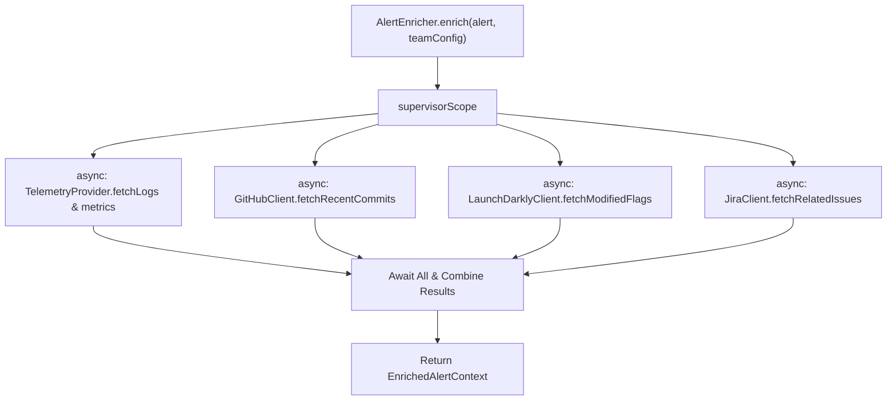

# Specification: Context Enrichment Feature (`:feature:enrichment`)

## 1. Overview & Objective
The Enrichment feature aggregates deep diagnostic context around an incoming alert across multiple external systems concurrently:
1. **Telemetry Providers**: Humio (logs), Sentry (stacktraces/exceptions), Firebase Crashlytics (crash counts).
2. **CI/CD & Source Code**: GitHub (recent commits, active pull requests, deployments).
3. **Feature Flags**: LaunchDarkly (recently modified feature flags/targeting rules).
4. **Issue Tracking**: Jira (related open bugs, incident tickets).

Enrichment executes asynchronously and concurrently using Kotlin Coroutines `supervisorScope`. If an external provider fails or times out, the enricher records partial context and does not abort the triage pipeline.

---

## 2. Domain Models & Contracts

### `com.argus.domain.model.EnrichedAlertContext`
```kotlin
@Serializable
data class EnrichedAlertContext(
    val alert: RawAlert,
    val metricSamples: List<MetricSample> = emptyList(),
    val logs: List<String> = emptyList(),
    val recentDeployments: List<String> = emptyList(),
    val activeFeatureFlags: List<String> = emptyList(),
    val relatedJiraTickets: List<String> = emptyList(),
    val providerErrors: List<String> = emptyList(),
)
```

### `com.argus.domain.model.MetricSample`
```kotlin
@Serializable
data class MetricSample(
    val timestamp: String,
    val value: Double,
    val unit: String,
)
```

---

## 3. Boundary Interfaces & DI Architecture

### Public Interfaces
```kotlin
package com.argus.enrichment.service

public interface AlertEnricher {
    public suspend fun enrich(alert: RawAlert, teamConfig: TeamConfig): EnrichedAlertContext
}
```

```kotlin
package com.argus.enrichment.telemetry

public interface TelemetryProvider {
    public val providerKey: String
    public suspend fun fetchRecentMetrics(query: String): List<MetricSample>
    public suspend fun fetchLogs(query: String): List<String>
}

public interface TelemetryRegistry {
    public fun register(provider: TelemetryProvider)
    public fun getProvider(key: String): TelemetryProvider?
}
```

### Integration Clients (Internal)
- `GitHubClient`: Fetches recent commits and active deployment tags.
- `LaunchDarklyClient`: Fetches flags toggled within incident window.
- `JiraClient`: Searches for matching component tickets.

### Koin Modules
- `enrichmentModule(telemetryRegistry, gitHubClient, ldClient, jiraClient)`: Production wiring.
- `consoleEnrichmentModule`: Mock / console logging enrichment for local testing.

---

## 4. Concurrent Fan-Out Flow Diagram



---

## 5. State Matrix (Valid & Invalid States)

| Scenario | Condition | Expected Behavior | Output Context |
| :--- | :--- | :--- | :--- |
| **Complete Success** | All providers (Telemetry, GitHub, LD, Jira) respond successfully | Aggregates all metrics, logs, commits, flags, tickets | `EnrichedAlertContext` with all fields populated |
| **Telemetry Timeout** | Sentry/Humio provider times out after threshold | Caught in `runCatching`, records warning in `providerErrors` | `EnrichedAlertContext` with logs=[], error recorded |
| **GitHub 401/403** | Invalid GitHub token or repository permissions | Logs error, appends to `providerErrors`, does not throw | `recentDeployments = []` |
| **Unregistered Telemetry Key** | `teamConfig.telemetryProviders` contains unknown key | Skips missing provider, records error in context | Partial context returned |
| **No Correlating Data** | External queries return 0 results | Normal nominal state, returns empty lists | Fully valid `EnrichedAlertContext` with empty lists |

---

## 6. Test Plan & Fakes
- **Unit Tests**:
  - `AlertEnricherTest`: Verifies parallel execution time, aggregation completeness, and resilience against individual provider failures.
  - `InMemoryTelemetryRegistryTest`: Verifies provider registration and lookup.
- **Fakes in `:test-fixtures`**:
  - `FakeTelemetryRegistry`
  - `FakeGitHubClient`
  - `FakeLaunchDarklyClient`
  - `FakeJiraClient`
