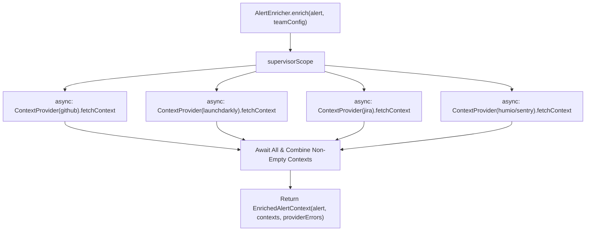

# Specification: Context Enrichment Feature (`:feature:enrichment`)

## 1. Overview & Objective
The Enrichment feature aggregates diagnostic context around an incoming alert across multiple external systems concurrently:
- **Telemetry Sources**: Humio (logs), Sentry (stacktraces/exceptions), Firebase Crashlytics (crash counts).
- **CI/CD & Source Code**: Commits, PRs, and deployment tags (GitHub).
- **Feature Flags**: Modified flags and targeting rules (LaunchDarkly).
- **Issue Tracking**: Associated bugs and incident tickets (Jira).

All diagnostic sources implement the unified `ContextProvider` interface, producing a structured `AlertContext` (composed of a `providerKey` and a list of context strings).

---

## 2. Domain Models & Contracts

### `com.argus.domain.model.AlertContext`
```kotlin
@Serializable
data class AlertContext(
    val providerKey: String,
    val items: List<String> = emptyList(),
)
```

### `com.argus.domain.model.EnrichedAlertContext`
```kotlin
@Serializable
data class EnrichedAlertContext(
    val alert: RawAlert,
    val contexts: List<AlertContext> = emptyList(),
    val providerErrors: List<String> = emptyList(),
)
```

---

## 3. Boundary Interfaces & DI Architecture

### Boundary Interfaces
```kotlin
package com.argus.enrichment.service

interface AlertEnricher {
    suspend fun enrich(alert: RawAlert, teamConfig: TeamConfig): EnrichedAlertContext
}
```

```kotlin
package com.argus.enrichment.provider

interface ContextProvider {
    val key: String
    suspend fun fetchContext(alert: RawAlert, teamConfig: TeamConfig): AlertContext
}
```

### Implementations (Internal)
- `DefaultAlertEnricher`: Asynchronously fans out over a `List<ContextProvider>`, collecting `AlertContext`s and catching provider failures into `providerErrors`.
- `ConsoleLoggingAlertEnricher`: Generates mock diagnostic context for local testing/demo mode.
- `GitHubContextProvider`, `LaunchDarklyContextProvider`, `JiraContextProvider`, `HumioContextProvider`, `SentryContextProvider`, `FirebaseContextProvider`: Concrete providers implementing `ContextProvider`.

---

## 4. Concurrent Fan-Out Flow Diagram



---

## 5. State Matrix (Valid & Invalid States)

| Scenario | Condition | Expected Behavior | Output Context |
| :--- | :--- | :--- | :--- |
| **Complete Success** | All providers respond successfully with data | Aggregates all provider contexts | `EnrichedAlertContext` with non-empty `contexts` |
| **Provider Timeout / Error** | An individual provider throws an exception | Caught in `runCatching`, records error in `providerErrors` | `contexts` contains remaining providers, error noted |
| **Provider Returns Empty** | Provider finds 0 correlating items | Empty `AlertContext.items` omitted or empty | Valid `EnrichedAlertContext` |
| **All Providers Fail** | Network partition across all providers | Catches all exceptions, records all errors | `contexts = []`, all errors in `providerErrors` |

---

## 6. Test Plan & Fakes
- **Unit Tests**:
  - `AlertEnricherTest`: Verifies parallel execution, provider-agnostic aggregation, and isolated error handling across `ContextProvider`s.
- **Fakes in `:test-fixtures`**:
  - `FakeContextProvider`
