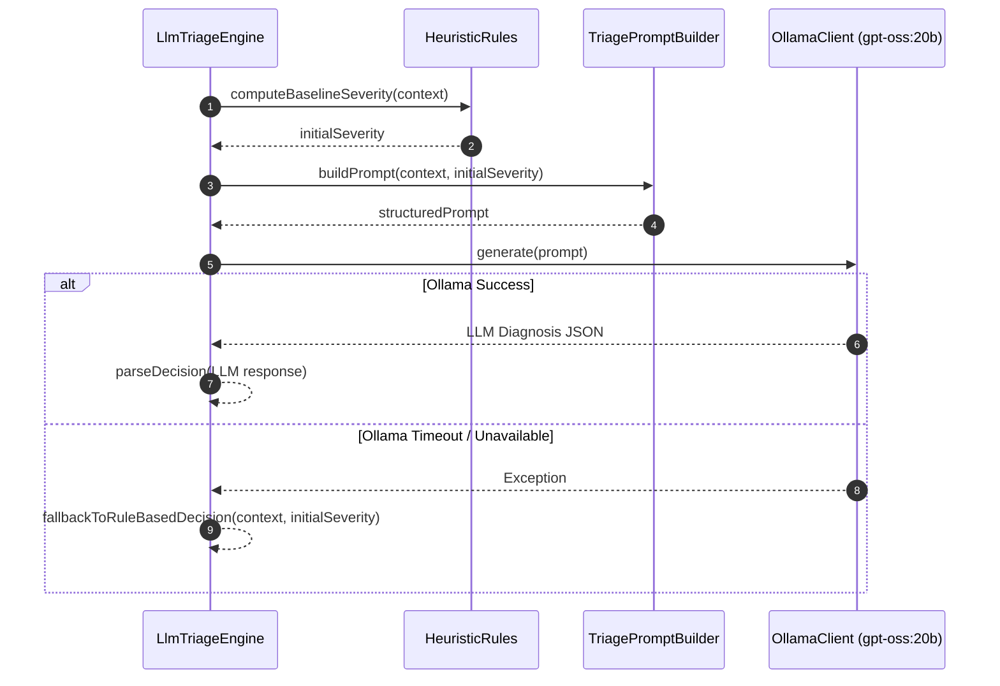

# Specification: Analysis & LLM Triage Feature (`:feature:analysis`)

## 1. Overview & Objective
The Analysis feature evaluates the `EnrichedAlertContext` to produce an actionable `AlertDecision`. It combines deterministic rule heuristics (spike threshold detection, deployment correlation) with generative LLM inference via a local Ollama instance (`gpt-oss:20b`) to synthesize root-cause hypotheses, severity ratings, and recommended remediation steps.

---

## 2. Domain Models & Contracts

### `com.argus.domain.model.AlertDecision`
```kotlin
@Serializable
data class AlertDecision(
    val teamId: String,
    val severity: AlertSeverity,
    val summary: String,
    val sourceSampleCount: Int,
    val rootCauseHypothesis: String? = null,
    val recommendedAction: String? = null,
)
```

### `com.argus.domain.model.AlertSeverity`
```kotlin
@Serializable
enum class AlertSeverity {
    INFO,
    WARNING,
    CRITICAL,
}
```

---

## 3. Boundary Interfaces & DI Architecture

### Boundary Interfaces
```kotlin
package com.argus.analysis.service

interface TriageEngine {
    suspend fun triage(context: EnrichedAlertContext): AlertDecision
}
```

```kotlin
package com.argus.analysis.llm

interface LlmClient {
    suspend fun generate(prompt: String): String
}
```

### Implementations (Internal)
- `LlmTriageEngine`: Constructs structured triage prompt containing telemetry samples, git commits, flags, and logs; queries `LlmClient`; parses response into `AlertDecision`.
- `RuleBasedTriageEngine`: Fast fallback evaluator using threshold heuristics when LLM is unavailable or disabled.
- `OllamaClient`: HTTP client communicating with local Ollama (`POST /api/generate` with model `gpt-oss:20b`).
- `ConsoleEchoLlmClient`: Mock LLM client returning formatted echo responses for local testing.

### Koin Modules
- `analysisModule(ollamaHost, model)`: Production LLM triage engine.
- `ruleBasedAnalysisModule`: Heuristic-only triage engine.
- `consoleAnalysisModule`: Local echo client triage engine.

---

## 4. Triage Sequence Diagram



---

## 5. State Matrix (Valid & Invalid States)

| Scenario | Condition | Expected Behavior | Output Decision |
| :--- | :--- | :--- | :--- |
| **Normal LLM Triage** | Ollama responds with valid diagnosis | Combines LLM synthesis with telemetry metadata | `AlertDecision` with LLM summary & severity |
| **High Metric Spike** | Metrics exceed 5x baseline | Heuristics elevate severity to `CRITICAL` | `severity = CRITICAL` |
| **Ollama Service Down** | `ConnectException` / HTTP 500 from Ollama | Catches error, falls back gracefully to `RuleBasedTriageEngine` | `AlertDecision` generated via heuristics with warning note |
| **LLM Output Corrupted** | LLM output is not valid JSON | Regex / parser falls back to raw text extraction without throwing | Valid `AlertDecision` with raw text as summary |
| **Empty Context Data** | Alert has no logs or metrics | Analyzes alert title and metadata alone | `AlertDecision(sourceSampleCount = 0)` |

---

## 6. Test Plan & Fakes
- **Unit Tests**:
  - `LlmTriageEngineTest`: Verifies prompt structure, fallback upon LLM failure, and severity calculations.
  - `RuleBasedTriageEngineTest`: Verifies heuristic threshold calculations.
- **Fakes in `:test-fixtures`**:
  - `FakeLlmClient`: Returns controllable prompt responses or simulates timeouts.
  - `FakeTriageEngine`: Returns static predefined `AlertDecision`s.
