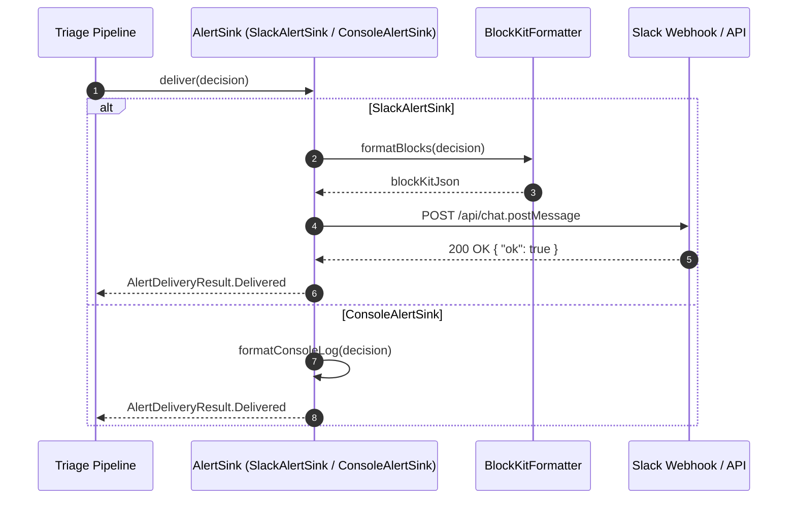

# Specification: Outbound Alert Dispatch Feature (`:feature:alert`)

## 1. Overview & Objective
The Alert feature delivers the final `AlertDecision` to designated operational channels (such as Slack, Jira issue creation, or incident management webhooks) formatted as rich, actionable messages. For local environments, alerts are routed to a console sink without making external network calls.

---

## 2. Domain Models & Contracts

### `com.argus.alert.sink.AlertDeliveryResult`
```kotlin
package com.argus.alert.sink

public sealed interface AlertDeliveryResult {
    public data object Delivered : AlertDeliveryResult
    public data class Failed(val reason: String, val cause: Throwable? = null) : AlertDeliveryResult
}
```

---

## 3. Boundary Interfaces & DI Architecture

### Public Interface
```kotlin
package com.argus.alert.sink

public interface AlertSink {
    public suspend fun deliver(decision: AlertDecision): AlertDeliveryResult
}
```

### Implementations (Internal)
- `SlackAlertSink`: Formats decision into Slack Block Kit JSON and posts to team `slackChannelId` using Ktor HTTP client.
- `ConsoleAlertSink`: Prints formatted alert summary and root-cause hypothesis to standard logging/console for local development.

### Koin Modules
- `alertSlackModule(slackToken)`: Production Slack dispatcher.
- `consoleAlertModule`: Local development console dispatcher.

---

## 4. Delivery Flow Diagram



---

## 5. State Matrix (Valid & Invalid States)

| Scenario | Condition | Expected Behavior | Delivery Result |
| :--- | :--- | :--- | :--- |
| **Successful Slack Post** | Valid channel ID & Slack API token | Slack API returns HTTP 200 `{"ok": true}` | `AlertDeliveryResult.Delivered` |
| **Slack API Rate Limit (429)** | Slack responds with HTTP 429 & `Retry-After` | Exponential backoff retry (up to 3 attempts) | `AlertDeliveryResult.Delivered` or `Failed` |
| **Invalid Slack Channel / Token** | Slack API returns `{"ok": false, "error": "channel_not_found"}` | Logs structured error, returns `Failed` | `AlertDeliveryResult.Failed("channel_not_found")` |
| **Network Partition / Timeout** | Socket timeout contacting Slack API | Catches exception, logs incident, returns `Failed` | `AlertDeliveryResult.Failed("ConnectTimeout")` |
| **Console Delivery** | Running with `localAppModules()` | Formats structured ANSI/text log to logger | `AlertDeliveryResult.Delivered` |

---

## 6. Test Plan & Fakes
- **Unit Tests**:
  - `SlackAlertSinkTest`: Verifies Block Kit JSON generation, payload formatting, and error handling.
  - `ConsoleAlertSinkTest`: Verifies console formatting and non-throwing execution.
- **Fakes in `:test-fixtures`**:
  - `FakeAlertSink`: In-memory delivery tracker with recorded `deliveredDecisions` list.
