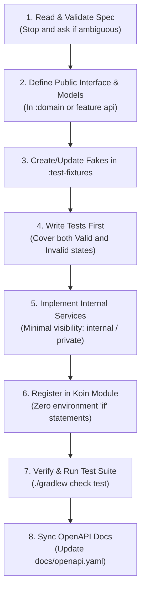

# Feature Specification & Implementation Guide

This guide establishes the mandatory workflow for designing, specifying, and implementing features in Argus. Every
feature begins with an exhaustive specification before code is written.

---

## 1. Specification-First Philosophy

In Argus, code is an implementation detail of a rigorously defined specification.

- **Never implement on intuition**: If a requirement, payload shape, timeout behavior, or error fallback is undefined,
  **stop and ask** rather than inventing semantics.
- **Single Source of Truth**: The feature spec document in `docs/spec/` is the authoritative definition of the feature's
  behavior, data contracts, and error states.
- **Exhaustive State Space**: A specification is incomplete if it only describes happy paths. Every failure mode
  (network partition, schema violation, third-party timeout, unregistered provider) must be explicitly modeled.

---

## 2. Anatomy of a Feature Specification

Every feature specification in `docs/spec/` must follow this standard template:

### Structure:

1. **Overview & Objective**:
    - What problem does this feature solve?
    - Which module does it belong to (`:feature:ingestion`, `:feature:enrichment`, `:feature:analysis`,
      `:feature:alert`)?
2. **Domain Models & Contracts**:
    - Strictly typed `@Serializable` Kotlin data classes and enums.
    - Comprehensive KDoc for every field and variant.
    - Zero loose types (no `Map<String, Any>` or untyped JSON).
3. **Boundary Interfaces & DI Architecture**:
    - Boundary interfaces and domain models (no explicit `public` keyword — public by default).
    - `internal` / `private` service and client implementation classes.
    - Koin module bindings (`production` and `local`/`test` variants).
4. **Data Flow & Sequence Diagram**:
    - Mermaid diagram illustrating inputs, async operations, concurrent fan-outs, and outbound calls.
5. **State Matrix (Valid & Invalid States)**:
    - **Valid States (Happy Path)**: Nominal inputs, expected return values, success status codes.
    - **Invalid States (Edge Cases & Errors)**: Malformed JSON, missing required fields, timeout thresholds, downstream
      HTTP errors (5xx/4xx), unregistered provider lookups.
    - **Fallback Behaviors**: Explicit recovery strategy (e.g. degrade gracefully, return typed error, log and drop).
6. **OpenAPI & Public API Sync**:
    - If HTTP routes are exposed, list path, method, request/response models, and status codes.
    - Synchronized with `docs/openapi.yaml` and `app/src/main/resources/openapi/documentation.yaml`.
7. **Test Plan & Test-Fixtures**:
    - Specific unit and integration test definitions.
    - Reusable in-memory fakes to be added or updated in `:test-fixtures`.

---

## 3. How to Implement from a Specification

Implementation must strictly follow the **Test-Driven Development (TDD)** lifecycle:

### Step-by-Step Implementation Rules:

1. **Step 1 — Clarify Ambiguities**:
   Review the specification. If any interaction is unclear, stop and resolve all open questions before writing code.
2. **Step 2 — Model Contracts**:
   Add or update domain models in `:domain` or feature boundary interfaces. Ensure all models are immutable (`val`) and
   annotated with `@Serializable` where serialized over network/DB.
3. **Step 3 — Build Test Fakes**:
   Create or update in-memory fakes in `:test-fixtures` implementing the real interface (e.g. `FakeAlertSink`,
   `FakeTelemetryRegistry`).
4. **Step 4 — Write Tests First (TDD)**:
   Write unit tests asserting expected results for all scenarios in the specification's State Matrix (both happy path
   and error cases). Tests should initially fail (or not compile).
5. **Step 5 — Write Minimal Implementation**:
   Implement internal classes marked `internal` with minimal visibility. Never let exceptions crash coroutines
   unhandled. Use structured logging (`logger.info("...", ...)`) instead of `println`.
6. **Step 6 — Wire via Koin**:
   Add definitions to the feature's Koin module (`myFeatureModule`) without hardcoding environmental branches
   (`if (isLocal)` is strictly prohibited).
7. **Step 7 — Verify Locally**:
   Run `./gradlew check test` using JDK 21. Confirm all test cases pass with **STRONG** certainty.
8. **Step 8 — Update OpenAPI Documentation**:
   Ensure all new/modified HTTP endpoints are reflected in `docs/openapi.yaml` and `documentation.yaml`.
9. **Step 9 — Code Style & ktlint Compliance**:
   Run ktlint formatting to ensure all Kotlin files adhere to organizational conventions before committing.
